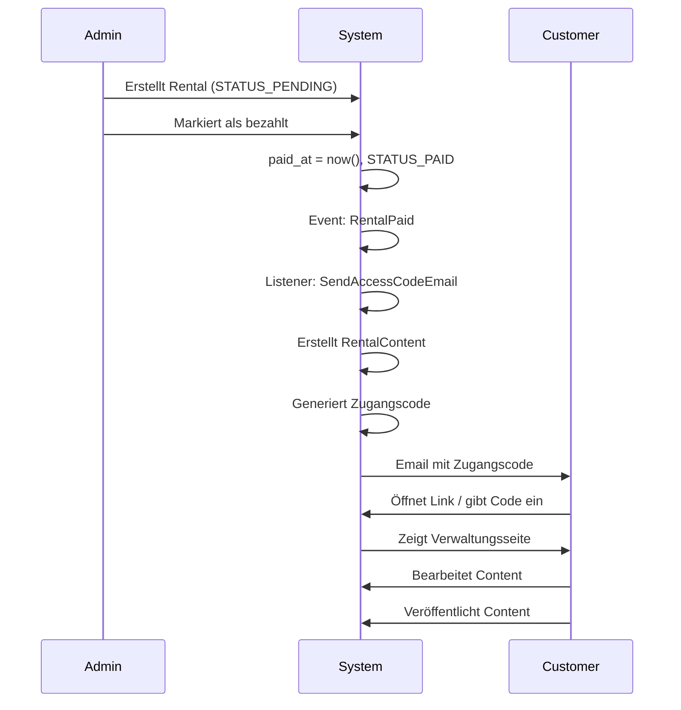

# Rental Content Management System - Implementierung

## Zusammenfassung

Ich habe ein vollständiges Content-Management-System für Kunden implementiert, damit sie ihre gemieteten Felder mit Inhalten füllen können.

## Erstellte Dateien

### Models

1. **`app/Models/RentalContent.php`**
   - Hauptmodel für Content-Verwaltung
   - Automatische Zugangscode-Generierung
   - Beziehung zu Rental

### Migrations

2. **`database/migrations/2026_02_03_120000_create_rental_contents_table.php`**
   - Erstellt `rental_contents` Tabelle
   - Felder: access_code, company_logo, title, description, website_url, contact_email, contact_phone, is_private_person, is_published, last_accessed_at

3. **`database/migrations/2026_02_03_120001_add_paid_at_to_rentals_table.php`**
   - Fügt `paid_at` zur `rentals` Tabelle hinzu
   - Erweitert Status-ENUM um 'pending' und 'paid'

### Events

4. **`app/Events/RentalPaid.php`**
   - Event das ausgelöst wird, wenn eine Rental bezahlt wurde

### Listeners

5. **`app/Listeners/SendAccessCodeEmail.php`**
   - Reagiert auf RentalPaid Event
   - Erstellt RentalContent mit Zugangscode
   - Versendet Zugangscode per Email an Kunden

### Controllers

6. **`app/Http/Controllers/RentalContentController.php`**
   - Öffentlicher Controller für Content-Verwaltung
   - Zugangscode-Validierung
   - Content-Bearbeitung
   - Logo-Upload für Firmen

### Routen

7. **`routes/web.php`** (erweitert)
   - `/rental-content/access` - Zugangscode-Formular
   - `/rental-content/access/{code}` - Direkter Zugriff
   - `/rental-content/manage/{code}` - Content-Verwaltung
   - POST/DELETE Routen für Updates und Logo-Löschung

### Seeders

8. **`database/seeders/RentalAccessCodeEmailTemplateSeeder.php`**
   - Erstellt Email-Template für Zugangscode-Versand
   - HTML und Text-Version
   - Alle Platzhalter für dynamische Daten

### Dokumentation

9. **`docs/RENTAL_CONTENT_MANAGEMENT.md`**
   - Vollständige Dokumentation des Systems
   - Workflow-Beschreibung
   - API-Referenz
   - Troubleshooting-Guide

## Erweiterte Models

### `app/Models/Rental.php`
- ✅ Hinzugefügt: `content()` HasOne Beziehung
- ✅ Hinzugefügt: `paid_at` Feld
- ✅ Hinzugefügt: `STATUS_PENDING` und `STATUS_PAID` Konstanten
- ✅ Hinzugefügt: `isPaid()` Methode

### `app/Models/Customer.php`
- ✅ Hinzugefügt: `isCompany()` Methode
- ✅ Hinzugefügt: `isPrivatePerson()` Methode

### `app/Providers/EventServiceProvider.php`
- ✅ Registriert: RentalPaid Event → SendAccessCodeEmail Listener

## Funktionen

### ✅ Zugangscode-System
- Automatische Generierung bei Erstellung
- Format: XXXX-XXXX-XXXX (12 Zeichen)
- Eindeutig und sicher
- Keine zeitliche Begrenzung

### ✅ Email-Benachrichtigung
- Automatisch nach Bezahlung
- Schönes HTML-Design
- Direktlink zur Verwaltung
- Template mit Platzhaltern

### ✅ Content-Verwaltung
- Titel und Beschreibung
- Kontaktinformationen (Email, Telefon)
- Website-URL
- Veröffentlichen/Entwurf-Status

### ✅ Logo-Upload
- Nur für Firmen (nicht Privatpersonen)
- Validierung: max 2MB, Formate: jpg, png, gif, svg
- Speicherung in `storage/app/public/rental-logos/`
- Löschen-Funktion

### ✅ Tracking
- Letzter Zugriffszeitpunkt wird gespeichert
- Basis für zukünftige Analytics

## Workflow



## Nächste Schritte (TODO)

Um das System komplett zu machen, müssen noch folgende Dateien erstellt werden:

### Views (nicht implementiert)
1. **`resources/views/rental-content/access-form.blade.php`**
   - Formular zur Eingabe des Zugangscodes
   
2. **`resources/views/rental-content/manage.blade.php`**
   - Verwaltungsseite für Content-Bearbeitung

### Optional
3. **Filament Resource für RentalContent**
   - Admin-Interface zur Verwaltung
   
4. **Tests**
   - Unit Tests für RentalContent Model
   - Feature Tests für Controller
   - Event/Listener Tests

## Installation & Setup

### 1. Migrationen ausführen
```bash
cd D:\Projekte\laravel-filament-foerdertafel\laravel
php artisan migrate
```

### 2. Email-Template erstellen
```bash
php artisan db:seed --class=RentalAccessCodeEmailTemplateSeeder
```

### 3. Storage-Link erstellen (für Logo-Uploads)
```bash
php artisan storage:link
```

### 4. Queue-Worker starten (für Email-Versand)
```bash
php artisan queue:work
```

## Verwendung

### Rental als bezahlt markieren

```php
use App\Events\RentalPaid;
use App\Models\Rental;

// Rental als bezahlt markieren
$rental = Rental::find($rentalId);
$rental->paid_at = now();
$rental->status = Rental::STATUS_PAID;
$rental->save();

// Event auslösen (triggert automatisch Email-Versand)
event(new RentalPaid($rental));
```

### Manuell RentalContent erstellen

```php
use App\Models\RentalContent;

$rentalContent = RentalContent::create([
    'rental_id' => $rental->id,
    'is_private_person' => $rental->customer->isPrivatePerson(),
]);

// Zugangscode wurde automatisch generiert
echo $rentalContent->access_code;
```

### Content prüfen

```php
// Nach Zugangscode suchen
$content = RentalContent::findByAccessCode('ABCD-1234-EFGH');

// Prüfen ob Logo hochgeladen werden kann
if ($content->canUploadLogo()) {
    // Ja, Kunde ist eine Firma
}

// Prüfen ob veröffentlicht
if ($content->isPublished()) {
    // Content ist öffentlich sichtbar
}
```

## Sicherheit

- ✅ Zugangscodes sind eindeutig und zufällig
- ✅ Alle Eingaben werden validiert
- ✅ Logo-Upload nur für berechtigte Nutzer
- ✅ Dateityp- und Größen-Prüfung
- ✅ Zugriffe werden protokolliert

## Support

Bei Fragen oder Problemen siehe:
- Dokumentation: `docs/RENTAL_CONTENT_MANAGEMENT.md`
- Laravel Logs: `storage/logs/laravel.log`
- Event-Liste: `php artisan event:list`
